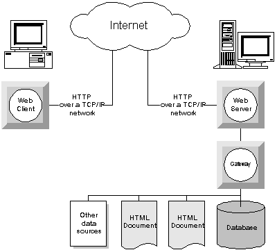

# How the internet works:

1. When you are trying to pull up a website, the browser sends a GET request to the DNS server first to get the IP address of that domain name.

**IP address** - IP(Internet Protocol) address is a unique identifier for identifying each computer to communicate over a network.

**Domain name** - It is like the name of the website before the top level domains such as .com or .org. Ex) **yahoo**.com. The yahoo is the domain name.

**TLD(Top Level Domain)** - .com, .net, .org are all examples of TLD. It is the highest level of the Domain Name System.

**DNS** - Domain Name Server. This converts a domain name into an IP address or vice versa.

2. The way to read a web address such as **http://www.njit.edu** . You read it as the protocol which in many cases is HTTP, then the domain name which is njit and the domain name extension which is .edu.

* HTTP is the schema, njit.edu is the hostname, and anything after that are objects.

**HTTP** - Hyper Text Transfer Protocol. It is the Protocol used to transfer data over the Web. Used for transmitting webpage data.
 It uses port 80. HTTP uses a client-server model and works as a request-response protocol. The client sends a type of request(typically a GET request) to the server and the server sends a response back which is usually the web page that is being requested.

**HTTPS** - secure version of HTTP. Encrypted HTTP connections take place over HTTPS by using SSL. It uses port 443.

*SSL** - Secure Socket Layer is a secure protocol developed for sending information securely over the internet. It encrypts the data being transmitted so that a third party cannot eavesdrop.

3. There are 4 main HTTP Requests(GET, POST, PUT, and DELETE).
* **GET** - It is used to request data from a specified source. Name-value pairs are shown in the URL.
* **POST** - Used to send data to a server to create/update a resource. It is not shown in the URL.
* **PUT** - The put method gets updates.
* **DELETE** - Deletes the specified resource.

4. The internet is essentially a giant database. More of a collection of databases instead of a collection of webpages.

